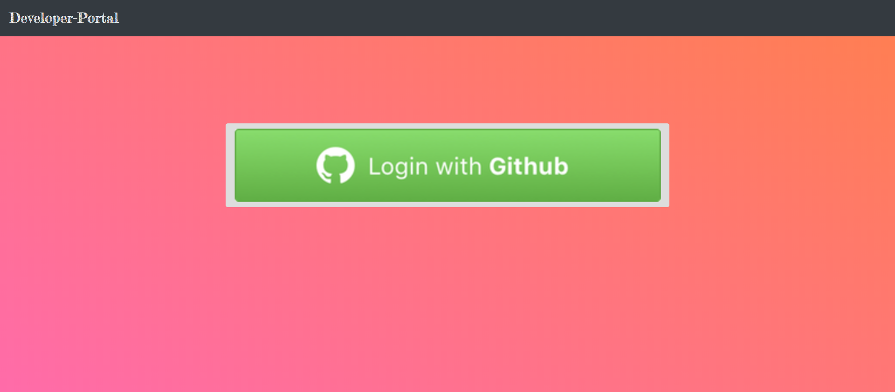
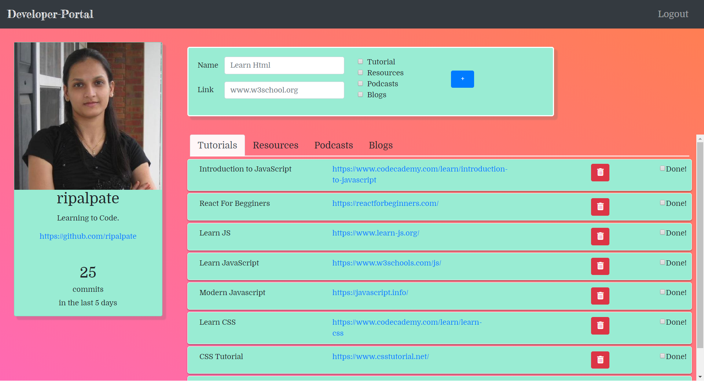

## Developer Plus Plus
This Application is the exploration of React. As User, When you login via Github, you will see your profile card. It will also allow you to add learning materials categorized in 4 difeerent categories. you will be able to mark resources as completed. When a resource is marked as completed it will show up at the bottom of the tab it belongs to. Further,it gives the ability to delete any references. 

## Technologies Used
* HTML
* JavaScript
* Bootstrap
* React
* Axios
* Firebase
* CRUD
* Webpack

## Screen shots
coming soon....
1. Login Page

2. Main Page

## How to Run this Project

This project was bootstrapped with [Create React App](https://github.com/facebook/create-react-app).

[Live Demo](https://developer-plus-plus-82f14.firebaseapp.com/)

